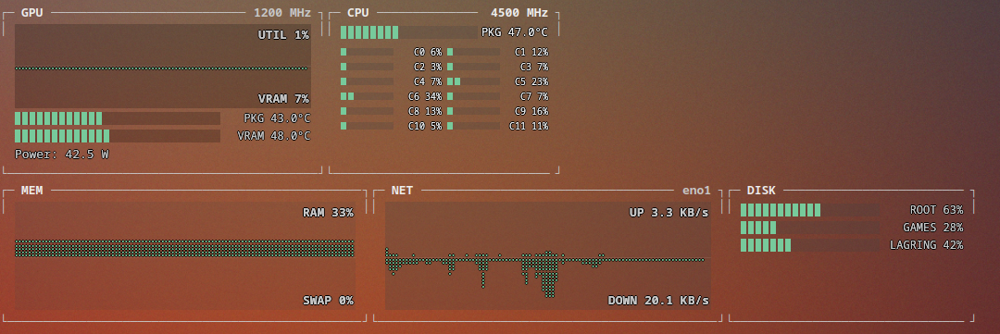

# plasmatop

A suite of KDE Plasma 6 widgets (plasmoids) that replace the built-in system
monitor widgets with ones that (a) actually support the Intel Arc B580 GPU
and (b) look like a proper terminal dashboard (bashtop/btop-style bar
graphs and colors) instead of the generic default Plasma look.

## Why

- Plasma's built-in CPU/Mem/Net/Disk widgets work fine, but the built-in GPU
  widget doesn't support Intel Arc (Battlemage). `nvtop` and `intel_gpu_top`
  already work on this machine and can source that data.
- The built-in widgets are visually generic. We want the color-coded,
  gradient bar-graph, "personality" look of `btop`/`bashtop`, as a Plasma
  widget instead of a terminal app.

## Scope (locked in at project kickoff, 2026-09-13)

- **Five separate, single-purpose widgets**, not one combined dashboard:
  `plasmatop-cpu`, `plasmatop-mem`, `plasmatop-net`, `plasmatop-disk`,
  `plasmatop-gpu`. Each can be added to the panel/desktop independently,
  same as the built-in ones today.
- **Visual reference: btop/bashtop style** — chunky gradient bar meters,
  warm color-coded thresholds, monospace-flavored readouts. A shared
  `shared/theme/` QML component library keeps all five widgets visually
  consistent.
- **GPU widget is the priority-one deliverable** — it's the actual capability
  gap today. CPU/Mem/Net/Disk are "nice to have, ours looks better," GPU is
  "the built-in one doesn't work at all."

## Environment this is built/tested against

- Fedora Linux 44 (KDE Plasma Desktop Edition)
- Plasma 6.7.5, Qt 6.11.2, `kpackagetool6`
- GPU: Intel Arc B580 (Battlemage G21), Xe/i915 kernel driver
- Data source tooling already installed: `nvtop`, `intel_gpu_top`, `sensors`
- No `plasmoidviewer`/`plasma-sdk` installed yet — part of the dev-environment
  setup task.

## Project structure

- `BACKLOG.md` — product backlog: epics and stories, prioritized.
- `SPRINTS.md` — sprint log / agile ceremony notes.
- `ARCHITECTURE.md` — technical design, written after the Sprint 0 research
  spike (data sourcing, QML rendering approach, packaging).
- `research/` — findings from research spikes.
- `docs/` — user-facing and developer documentation.
- `widgets/plasmatop-<name>/` — one Plasma 6 plasmoid package per widget.
- `shared/theme/` — shared QML components (bar meters, graphs, color scales,
  fonts) reused across all five widgets.
- `tools/` — dev scripts (install/reload/test helpers).
